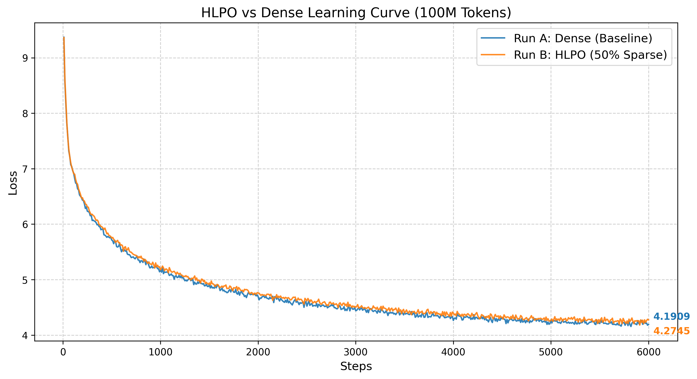
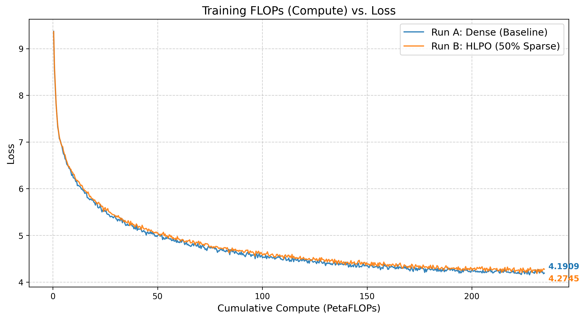
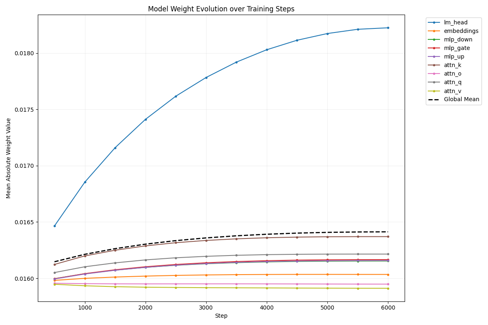
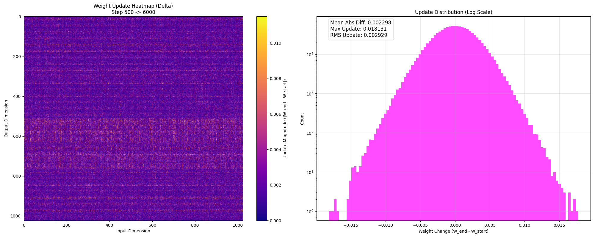

# HLPO A/B 测试结论

## 1. 测试目的

HLPO 的完整目标是把元引擎中的“交互”问题转译为 attention 的结构选择机制。这个 A/B 测试验证其中最小、最清楚的一条路径：

> 当 attention 只保留 50% 连接时，模型还能不能保持接近 Dense attention 的训练效果？

如果可以，说明 attention 连接中存在可以被结构化利用的冗余；如果不可以，说明 hard gate 破坏了训练过程。

## 2. 实验设置

```text
Run A: Dense baseline
Run B: HLPO HardGate
硬件环境: Mac Studio, M2 Ultra, 64GB unified memory
训练框架: PyTorch + MPS
模型规模: HLPO-0.5B
数据集: FineWeb-Edu streaming
上下文长度: 512
Batch size: 32
训练规模: ~100M tokens / 6000 steps
HLPO 稀疏度: 50%
核心指标: final loss、loss gap、loss curve
```

## 3. 结果

```text
Dense final loss: 4.1909
HLPO final loss: 4.2745
Loss gap: 0.0836
HLPO sparsity: 50%
```

## 4. 结论

HLPO HardGate 在只保留约一半 attention connections 的情况下，final loss 比 Dense 高 0.0836。这个差距存在，但不大；更重要的是，loss 曲线没有显示出明显训练崩坏。

这说明在该实验设置下，hard-gate sparse attention 是可训练的。模型不一定需要让所有 attention relation 都进入主要计算路径，至少有一部分连接可以被结构化跳过。

## 5. 图片如何阅读



`loss_comparison.png`：看 Dense 和 HLPO 的 loss 是否持续接近。如果 HLPO 曲线大幅偏离或震荡，说明 hard gate 破坏训练；当前曲线显示 HLPO 仍跟随 Dense 收敛。



`flops_vs_loss.png`：看稀疏计算与 loss 之间的代价关系。它不是最终加速证明，而是 compute-loss tradeoff 的展示。



`weight_evolution.png`：看训练过程中不同模块权重是否连续演化，说明模型确实在稀疏路径下学习，而不是只得到一个静态结果。



`weight_diff_500_6000.png`：看从 step 500 到 step 6000 的权重变化，说明训练过程有可追踪的更新。

## 6. 实验边界

这个实验可以支持的结论是：

- 在当前训练设置下，HLPO HardGate 没有破坏模型的基本收敛过程。
- 50% sparse attention 带来的 final loss gap 为 0.0836。
- attention 连接中存在可被结构化利用的冗余，值得继续研究稀疏训练和稀疏推理的一体化路径。

这个实验不能直接推出：

- 所有模型和所有任务中都有 50% attention 连接可以无损删除。
- HLPO 已经可以完全替代 dense attention。
- Python 层 top-k / mask 实现已经带来真实推理加速。
- Triton、CUDA、Rust 或 RTL 等工程下沉探索已经构成同一个端到端 benchmark 结论。

因此，这个 A/B 测试更适合作为 HLPO 的第一性工程证据：它证明交互注意力中的结构选择思想可以先以 HardGate sparse attention 的形式进入完整训练对照，并且在 50% 稀疏设置下保持接近 Dense 的训练质量。
