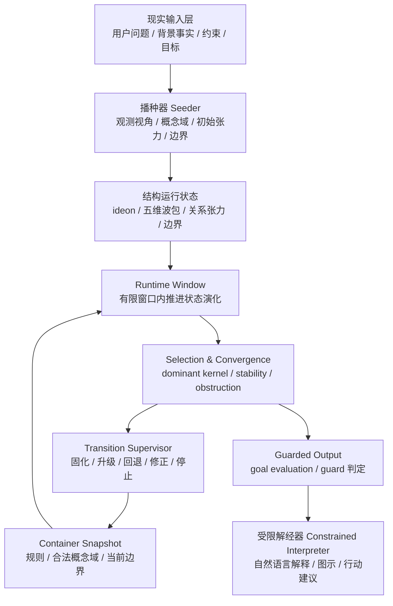
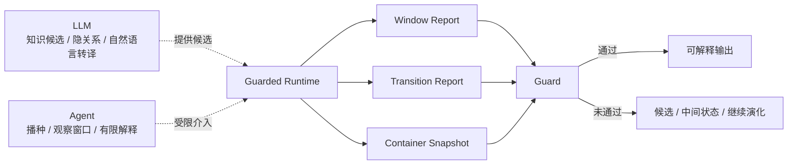
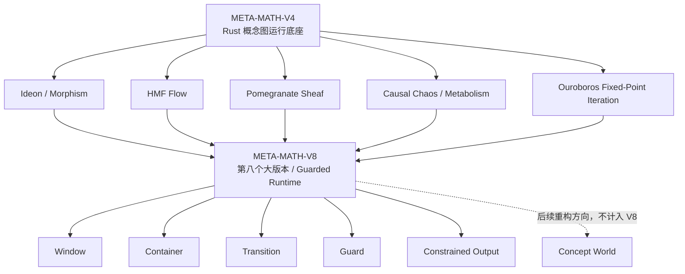

# META-MATH-V8 运行结构图 / Runtime Structure

## 1. 总体结构



## 2. Agent-in-loop



## 3. LLM 与 Runtime 的边界

```text
LLM:
  提供可能性、背景知识、候选补全、自然语言表达

Runtime:
  执行窗口推进、结构校验、目标评估、跃迁监督和 guard 判定

Agent:
  负责播种、观察、有限解释和必要时重播种

Guard:
  决定当前状态是否拥有解释权
```

## 4. V4 到 V8 的位置关系


