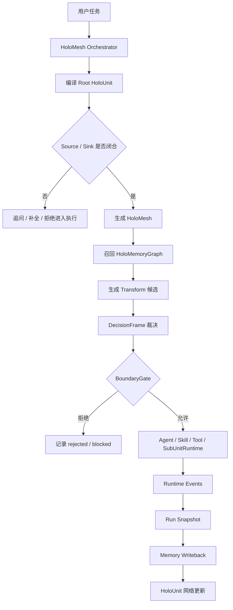
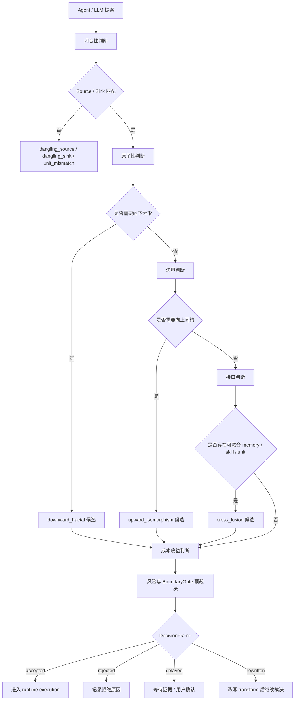
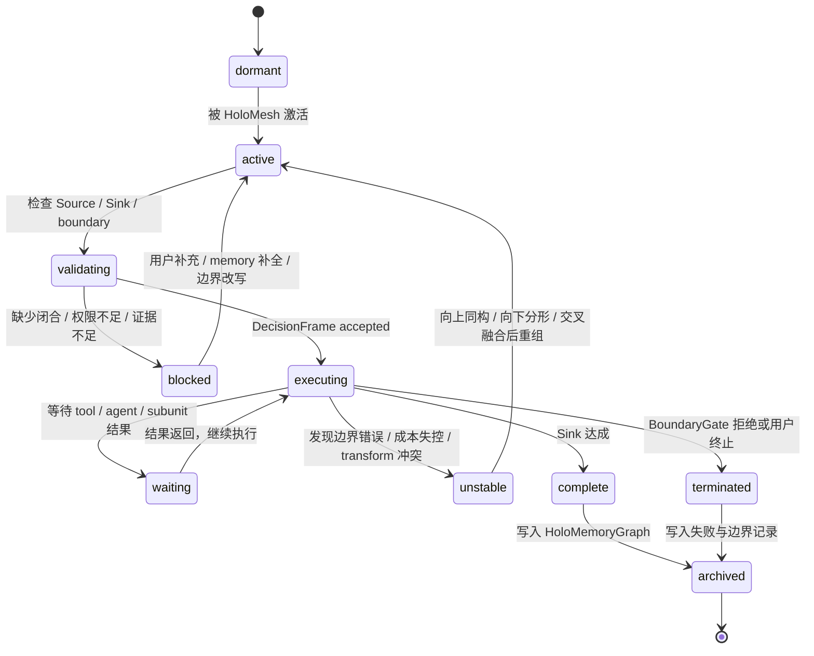
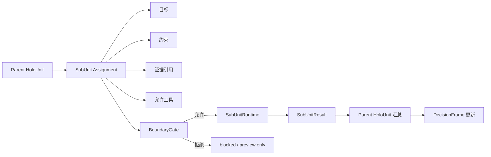
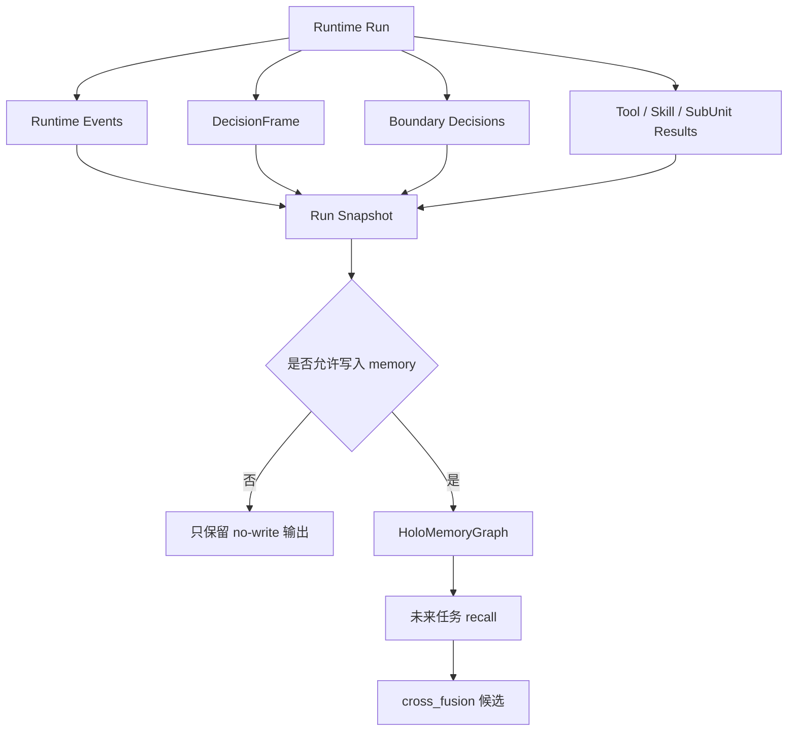

# HoLO 运行时逻辑与状态机图示 / Runtime Diagrams

## 1. Runtime 总链路

## 2. HoloMesh 裁决逻辑

## 3. HoloUnit 状态机

## 4. SubUnitRuntime 边界

SubUnitRuntime 的关键边界是：subagent 不是自由对话模型，而是由 parent HoloUnit 分配目标、证据、工具范围和退出条件的局部执行资源。

## 5. Memory 回写逻辑

HoLO 的 memory 不是简单聊天历史，而是结构化运行经验：任务如何闭合、如何拆解、哪些 transform 被接受或拒绝、哪些工具和 subunit 路径有效、哪些边界曾经阻塞。
